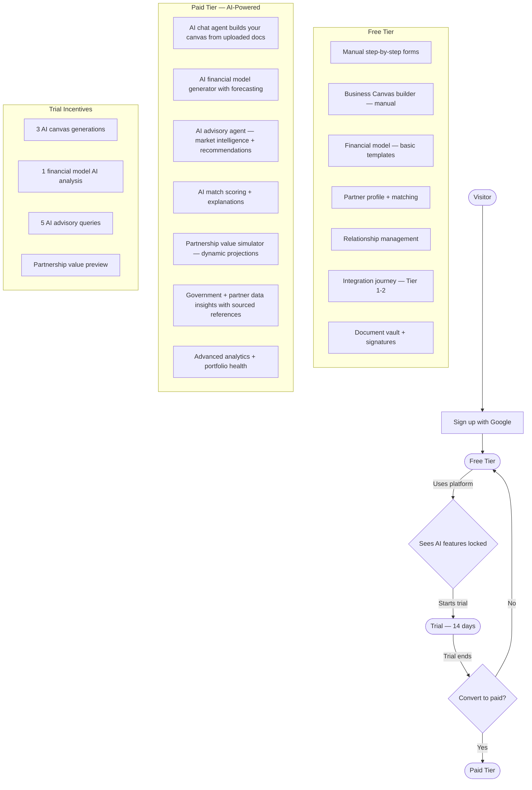
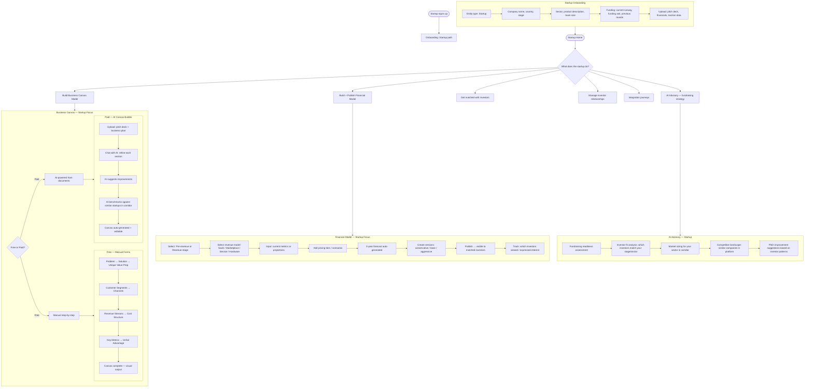
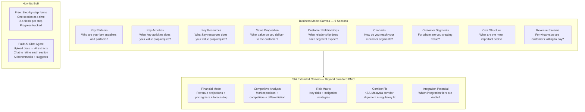
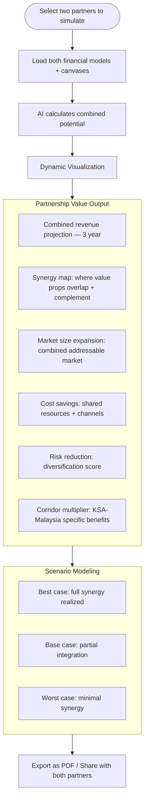
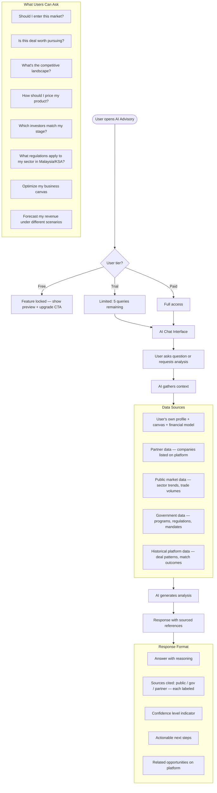
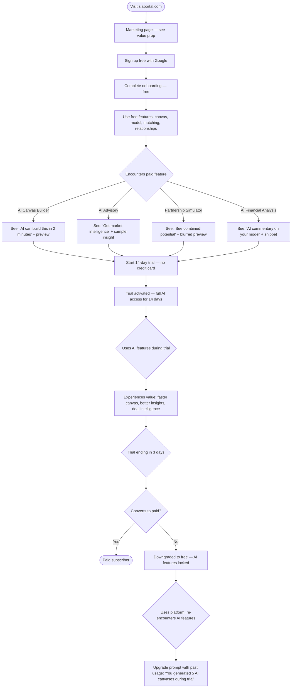

# Persona Activity Diagrams

Each user type has a dedicated experience with its own journey, tools, and visualizations.

---

## Product Tiers — Product-Led Growth



---

## Persona 1 — GCC Investor

### Full Activity Diagram



```mermaid
flowchart TD
    START([GCC Investor signs up]) --> ONBOARD[Onboarding: Investor path]

    subgraph ONBOARD_FLOW [Investor Onboarding]
        O1[Entity type: Investor] --> O2[Org: fund name, country, AUM]
        O2 --> O3[Investment thesis: sectors, stage, ticket size, geography]
        O3 --> O4[Upload: fund deck, mandate letter, track record]
        O4 --> O5[Integration tier interest: service / business / company]
    end

    ONBOARD_FLOW --> HOME([Investor Home])

    HOME --> ACTIONS{What does the investor do?}

    ACTIONS --> MATCHES[View AI-matched opportunities]
    ACTIONS --> PORTFOLIO[Manage investment portfolio]
    ACTIONS --> CANVAS[Business Canvas — assess deal structure]
    ACTIONS --> FINMODEL[Review startup financial models]
    ACTIONS --> ADVISORY[AI Advisory — market intelligence]
    ACTIONS --> RELATIONSHIPS[Manage relationships]
    ACTIONS --> JOURNEY[Integration journeys]

    subgraph MATCH_FLOW [Matching Experience — Investor View]
        M1[See match cards: Malaysian companies + startups]
        M1 --> M2[Each card: company profile, sector, funding need, match score]
        M2 --> M3{Accept or decline}
        M3 -->|Accept| M4[Wait for mutual acceptance]
        M4 --> M5[Relationship created → view company details]
        M3 -->|Decline| M6[Card removed, logged in history]
    end

    subgraph PORTFOLIO_FLOW [Investor Portfolio]
        IP1[Deal tracker: active investments]
        IP1 --> IP2[Committed capital by sector]
        IP2 --> IP3[Pipeline deals — matched but not yet invested]
        IP3 --> IP4[Exits and returns]
        IP4 --> IP5[Portfolio analytics: diversification, sector coverage]
        IP5 --> IP6[Share portfolio view with matched companies]
    end

    subgraph CANVAS_FLOW [Business Canvas — Investor Use]
        IC1[View partner's business canvas]
        IC1 --> IC2[Assess: value proposition, customer segments, channels]
        IC2 --> IC3[Compare canvases across multiple matches]
        IC3 --> IC4[AI analysis: strengths, gaps, market fit]
    end

    subgraph FINMODEL_FLOW [Financial Model Review]
        IF1[See financial summary cards of matched startups]
        IF1 --> IF2[Compare: revenue, funding ask, runway, traction]
        IF2 --> IF3[Express interest → initiates relationship]
        IF3 --> IF4[AI commentary: risks, comparables]
    end

    subgraph ADVISORY_FLOW [AI Advisory — Investor]
        IA1[Market trends: KSA-Malaysia corridor]
        IA1 --> IA2[Sector deep-dives with sourced data]
        IA2 --> IA3[Deal recommendations based on thesis]
        IA3 --> IA4[Risk analysis for specific opportunities]
        IA4 --> IA5[Sources: public data + gov data + partner data]
    end

    MATCHES --> MATCH_FLOW
    PORTFOLIO --> PORTFOLIO_FLOW
    CANVAS --> CANVAS_FLOW
    FINMODEL --> FINMODEL_FLOW
    ADVISORY --> ADVISORY_FLOW
```

### Investor Home Dashboard

```
┌─────────────────────────────────────────────────────────────┐
│  [Fund Name] — GCC Investor                                 │
│  AUM: $XXM · Sectors: Tech, Halal, Energy · Ticket: $2-10M │
│  Profile: ████████░░ 85%  ✓ Verified                        │
├─────────────────────────────────────────────────────────────┤
│                                                             │
│  ⚡ Action Required                                         │
│  • 3 new match suggestions                    [View]        │
│  • Sign NDA for DataVault MY                  [Sign]        │
│  • Review updated financial model — AlphaAI   [Review]      │
│                                                             │
│  📊 Portfolio Snapshot                                       │
│  Active: 4 deals · Committed: $8.2M · Pipeline: 2 · 3 sectors │
│                                         [View Portfolio]    │
│                                                             │
│  🤝 Active Relationships (5)                                │
│  DataVault MY — Tier 1 in progress    ██░░░  [View]         │
│  SolarTech KL — Negotiating           ████░  [View]         │
│  GovTech MDEC — Active partner        █████  [View]         │
│                                                             │
│  💡 AI Insights (Paid)                                      │
│  "Halal food sector seeing 23% YoY growth in corridor..."   │
│  "3 new companies match your thesis this week"              │
│                                                             │
│  [+ Express Interest]  [View Matches]  [AI Advisory 🔒]    │
└─────────────────────────────────────────────────────────────┘
```

---

## Persona 2 — Malaysian Company

### Full Activity Diagram



```mermaid
flowchart TD
    START([Malaysian Company signs up]) --> ONBOARD[Onboarding: Company path]

    subgraph ONBOARD_FLOW [Company Onboarding]
        O1[Entity type: Company] --> O2[Org: company name, registration #, MDEC status]
        O2 --> O3[Sector, infrastructure type, revenue stage]
        O3 --> O4[What they seek: capital, JV, strategic alliance, MOU]
        O4 --> O5[Upload: company registration, project briefs, certifications]
    end

    ONBOARD_FLOW --> HOME([Company Home])

    HOME --> ACTIONS{What does the company do?}

    ACTIONS --> CANVAS[Build Business Canvas Model]
    ACTIONS --> FINMODEL[Publish Financial Model]
    ACTIONS --> MATCHES[View investor matches]
    ACTIONS --> PORTFOLIO[Manage project/asset portfolio]
    ACTIONS --> ADVISORY[AI Advisory — funding strategy]
    ACTIONS --> RELATIONSHIPS[Manage partnerships]
    ACTIONS --> JOURNEY[Integration journeys]

    subgraph CANVAS_BUILD [Business Canvas Builder]
        direction TB
        BC1{Free or Paid?}
        BC1 -->|Free| BC_MANUAL[Step-by-step manual forms]
        BC1 -->|Paid| BC_AI[Chat with AI + upload docs]

        subgraph MANUAL [Manual Canvas — Free]
            BM1[Key Partners] --> BM2[Key Activities]
            BM2 --> BM3[Key Resources]
            BM3 --> BM4[Value Proposition]
            BM4 --> BM5[Customer Relationships]
            BM5 --> BM6[Channels]
            BM6 --> BM7[Customer Segments]
            BM7 --> BM8[Cost Structure]
            BM8 --> BM9[Revenue Streams]
        end

        subgraph AI_CANVAS [AI Canvas — Paid]
            BA1[Upload: pitch deck, business plan, financials]
            BA1 --> BA2[AI reads documents and extracts canvas data]
            BA2 --> BA3[AI generates draft canvas with all 9 sections]
            BA3 --> BA4[User reviews and edits each section]
            BA4 --> BA5[AI suggests improvements based on market data]
        end

        BC_MANUAL --> MANUAL
        BC_AI --> AI_CANVAS
    end

    subgraph FINMODEL_BUILD [Financial Model Builder]
        FM1[Select revenue model type]
        FM1 --> FM2{Model type}
        FM2 -->|SaaS| FM_SAAS[MRR, churn, CAC, LTV]
        FM2 -->|Marketplace| FM_MKT[GMV, take rate, buyer/seller growth]
        FM2 -->|Infrastructure| FM_INFRA[Capacity, utilization, contract value]
        FM2 -->|Manufacturing| FM_MFG[Units, COGS, margins]

        FM_SAAS --> FM3[Add pricing tiers]
        FM_MKT --> FM3
        FM_INFRA --> FM3
        FM_MFG --> FM3

        FM3 --> FM4[Forecasting: 3-year projection]
        FM4 --> FM5[Version management: create scenarios]
        FM5 --> FM6[Publish → visible to matched investors only]
    end

    subgraph PARTNERSHIP_VALUE [Partnership Value Simulator — Paid]
        PV1[Select two partners to simulate]
        PV1 --> PV2[AI calculates combined revenue potential]
        PV2 --> PV3[Dynamic visualization: merged financial projections]
        PV3 --> PV4[Scenario modeling: best/base/worst case]
        PV4 --> PV5[Show corridor-specific multipliers]
    end

    CANVAS --> CANVAS_BUILD
    FINMODEL --> FINMODEL_BUILD
    ADVISORY -->|Paid| PARTNERSHIP_VALUE
```

### Company Home Dashboard

```
┌─────────────────────────────────────────────────────────────┐
│  [Company Name] — Malaysian Company                         │
│  Sector: Data Centers · MDEC Certified · Revenue Stage      │
│  Profile: ██████████ 100%  ✓ Verified                       │
├─────────────────────────────────────────────────────────────┤
│                                                             │
│  ⚡ Action Required                                         │
│  • Complete your Business Canvas               [Build]      │
│  • 2 investors expressed interest              [View]       │
│  • Upload Q2 financials for investors          [Upload]     │
│                                                             │
│  📋 Business Canvas                                         │
│  ┌──────────┬──────────┬──────────┐                         │
│  │Key       │Value     │Customer  │                         │
│  │Partners  │Prop.     │Segments  │                         │
│  │ ████     │ ████     │ ████     │  Completeness: 70%      │
│  └──────────┴──────────┴──────────┘  [Edit Canvas]          │
│                                                             │
│  💰 Financial Model: v3 · Published · 2 interested investors│
│  Revenue: $1.2M ARR · Ask: $5M · Runway: 14 mo             │
│                                         [Edit Model]       │
│                                                             │
│  📊 Portfolio: 3 projects · 2 active · 1 pipeline           │
│                                                             │
│  🤝 Relationships (3)                                       │
│  AlFaisal Capital — Tier 1 ██░░░       [View]               │
│  Riyadh Ventures — Engaged ████░       [View]               │
│                                                             │
│  💡 AI Advisory (Paid): "Your sector is trending..."  🔒    │
│                                                             │
│  [+ Publish Model]  [View Matches]  [AI Canvas Builder 🔒] │
└─────────────────────────────────────────────────────────────┘
```

---

## Persona 3 — Government Entity

### Full Activity Diagram



```mermaid
flowchart TD
    START([Government Entity signs up]) --> ONBOARD[Onboarding: Government path]

    subgraph ONBOARD_FLOW [Government Onboarding]
        O1[Entity type: Government] --> O2[Ministry/Agency name, country]
        O2 --> O3[Programs: active bilateral programs, mandates]
        O3 --> O4[Sectors of interest, MOU registry]
        O4 --> O5[Upload: government credentials, program briefs, MOU copies]
    end

    ONBOARD_FLOW --> HOME([Government Home])

    HOME --> ACTIONS{What does the gov entity do?}

    ACTIONS --> OVERSIGHT[Bilateral engagement oversight]
    ACTIONS --> PROGRAMS[Manage programs + mandates]
    ACTIONS --> PARTNERS[View registered partners in corridor]
    ACTIONS --> MOUS[MOU registry + tracking]
    ACTIONS --> JOURNEYS[Monitor integration journeys]
    ACTIONS --> ADVISORY[AI Advisory — policy intelligence]

    subgraph OVERSIGHT_FLOW [Bilateral Engagement Oversight]
        OV1[Dashboard: all partnerships in corridor]
        OV1 --> OV2[Filter by: sector, tier, country, status]
        OV2 --> OV3[Aggregate stats: total deals, capital flow, MOUs signed]
        OV3 --> OV4[Export reports for ministerial briefings]
    end

    subgraph PROGRAM_FLOW [Program Management]
        PG1[Create/edit national programs]
        PG1 --> PG2[Set program mandates: sector, budget, timeline]
        PG2 --> PG3[Link programs to active partnerships]
        PG3 --> PG4[Track program KPIs: companies engaged, capital facilitated]
    end

    subgraph MOU_FLOW [MOU Registry]
        MO1[All MOUs: signed, in-progress, expired]
        MO1 --> MO2[MOU detail: parties, terms, status, renewal date]
        MO2 --> MO3[Attach MOU to integration journey]
        MO3 --> MO4[Notification: MOU expiring in 30 days]
    end

    subgraph GOV_ADVISORY [AI Advisory — Government]
        GA1[Corridor health metrics: deal volume, sector trends]
        GA1 --> GA2[Policy impact analysis on bilateral trade]
        GA2 --> GA3[Sourced data: public + partner + governmental]
        GA3 --> GA4[Recommendations for program optimization]
    end

    OVERSIGHT --> OVERSIGHT_FLOW
    PROGRAMS --> PROGRAM_FLOW
    MOUS --> MOU_FLOW
    ADVISORY --> GOV_ADVISORY
```

### Government Home Dashboard

```
┌─────────────────────────────────────────────────────────────┐
│  [Ministry/Agency Name] — Government Entity                 │
│  Country: Malaysia · Programs: 4 active · MOUs: 12          │
│  Profile: ████████░░ 90%  ✓ Verified                        │
├─────────────────────────────────────────────────────────────┤
│                                                             │
│  📊 Corridor Overview                                       │
│  Partners: 45 · Active deals: 18 · Capital flow: $62M       │
│  Sectors: Tech (35%) · Halal (25%) · Energy (20%) · Other   │
│                                                             │
│  ⚡ Action Required                                         │
│  • MOU #7 expires in 28 days                  [Review]      │
│  • Tier 4B escalation: TechBridge-Riyadh VC   [Review]      │
│  • New program brief from Saudi Embassy       [View]        │
│                                                             │
│  📋 Active Programs                                         │
│  Digital Infrastructure Initiative  12 partners  [Manage]   │
│  Halal Export Corridor Program      8 partners   [Manage]   │
│  Vision 2030 Tech Exchange          5 partners   [Manage]   │
│                                                             │
│  📑 MOU Registry                                            │
│  12 total · 8 active · 2 in-progress · 2 expiring           │
│                                         [View All]          │
│                                                             │
│  🏗️ Integration Journeys Monitored                          │
│  3 at Tier 2 · 1 at Tier 4A · 1 at Tier 5 (diplomatic)     │
│                                         [Monitor]           │
│                                                             │
│  💡 AI Policy Insights (Paid)  🔒                           │
│  [Export Corridor Report]  [View Partners]  [AI Advisory]   │
└─────────────────────────────────────────────────────────────┘
```

---

## Persona 4 — Startup / Investment Seeker

### Full Activity Diagram



### Startup Home Dashboard

```
┌─────────────────────────────────────────────────────────────┐
│  [Startup Name] — Startup                                   │
│  Stage: Series A · Sector: AI/ML · Country: Malaysia        │
│  Profile: ██████░░░░ 60%  ⏳ Pending Verification           │
├─────────────────────────────────────────────────────────────┤
│                                                             │
│  ⚡ Action Required                                         │
│  • Complete Business Canvas (4/9 sections done) [Continue]  │
│  • Publish financial model to attract investors [Build]     │
│  • Upload pitch deck to improve match quality   [Upload]    │
│                                                             │
│  📋 Business Canvas                                         │
│  ┌────────┬────────┬────────┬────────┬────────┐             │
│  │Partners│Activit.│Value   │Custmrs │Channels│             │
│  │  ✓     │  ✓     │  ✓     │  ✗     │  ✗     │ 4/9 done   │
│  ├────────┴────────┼────────┴────────┴────────┤             │
│  │Cost Structure   │Revenue Streams           │             │
│  │  ✓              │  ✗                       │             │
│  └─────────────────┴──────────────────────────┘             │
│  [Edit Canvas]  [AI Canvas Builder 🔒]                      │
│                                                             │
│  💰 Financial Model: Not published yet                      │
│  [Build Financial Model]                                    │
│                                                             │
│  🤝 Matches: 2 pending investor suggestions                 │
│                                         [View Matches]      │
│                                                             │
│  💡 AI Fundraising Coach (Paid)  🔒                         │
│  "Complete your canvas + model to unlock 3x more matches"   │
│                                                             │
│  [Build Canvas]  [Build Model]  [View Matches]              │
└─────────────────────────────────────────────────────────────┘
```

---

## Business Canvas Model — Detailed Structure



---

## Partnership Value Simulator (Paid Feature)



---

## AI Advisory Agent — Activity Flow



---

## Product-Led Growth — Conversion Funnel


