# Superpowers, OKR System & Deal Lifecycle

## The Core Idea

SIA Portal gives every persona **superpowers** — the ability to do in days what normally takes months. The platform removes friction, unlocks integration, and makes deals happen by:

1. **Matching** — finding the right partner through data, not luck
2. **Aligning** — OKRs that connect your goals to your partner's goals
3. **Documenting** — LOI → NDA → MoU → Contract flow with collaborative editing
4. **Signing** — digital signatures that advance the deal automatically
5. **Auditing** — full transparency on every step for every party
6. **Communicating** — secure deal rooms where all stakeholders collaborate
7. **Projecting** — financial models that show combined potential in numbers

---

## The 7 Superpowers

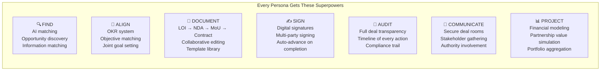

---

## OKR System — Objectives & Key Results

### How It Works

Every organization defines their OKRs. The platform then:
1. **Matches objectives** between organizations — finds where goals align
2. **Localizes objectives** — breaks partner objectives into actions your org can contribute to
3. **Joins objectives** — creates shared OKRs when two orgs decide to partner
4. **Estimates CAPEX/OPEX** — AI calculates what it takes financially to achieve each objective
5. **Tracks progress** — real-time KR completion feeds into relationship health and integration progress

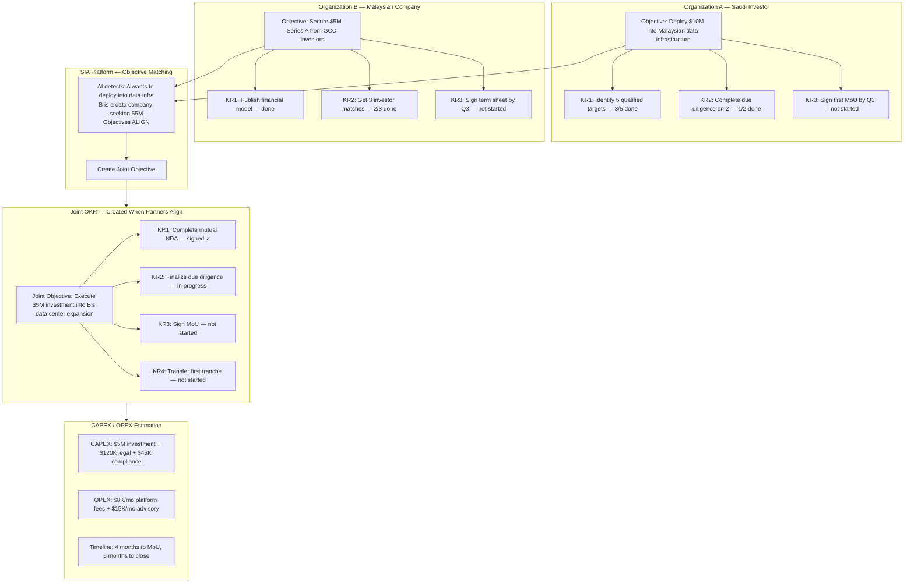

### OKR Activity Flow

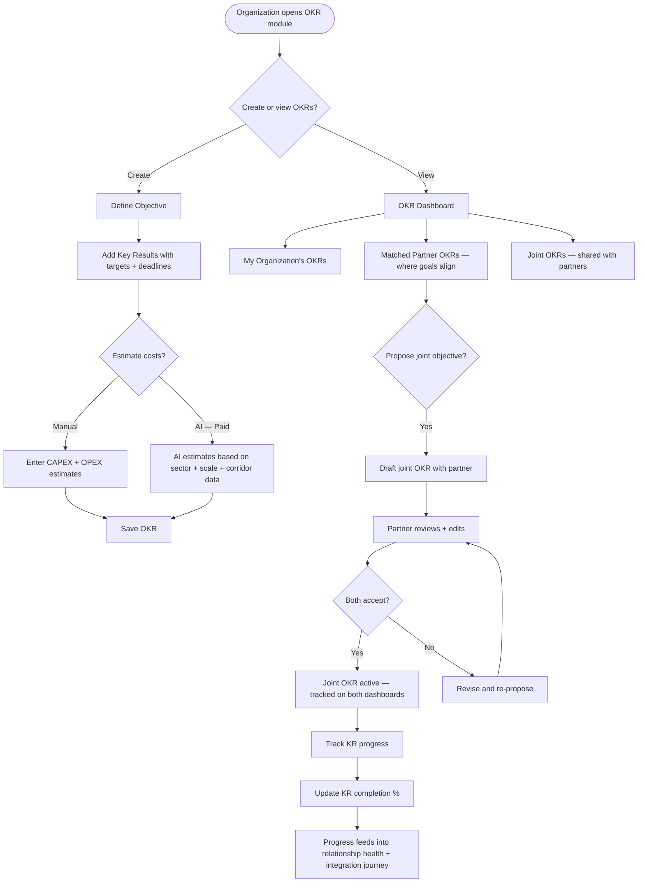

### OKR per Persona

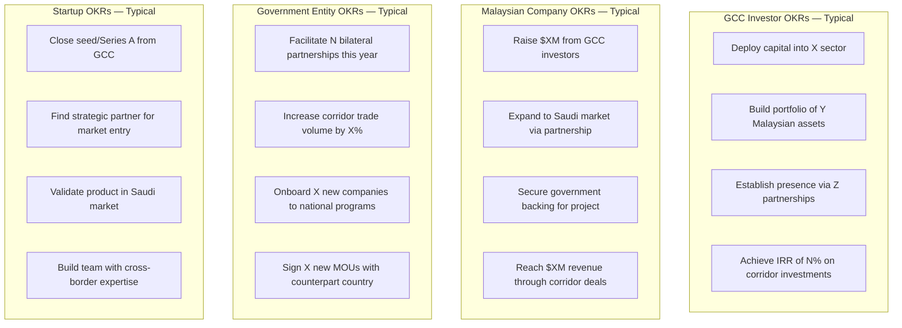

---

## Deal Document Lifecycle

Every deal flows through a standard document chain. The platform provides templates, collaborative editing, and digital signatures at each stage.

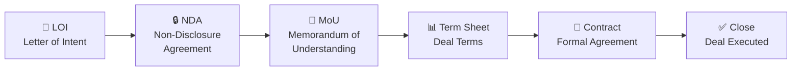

### Document Flow — Detailed

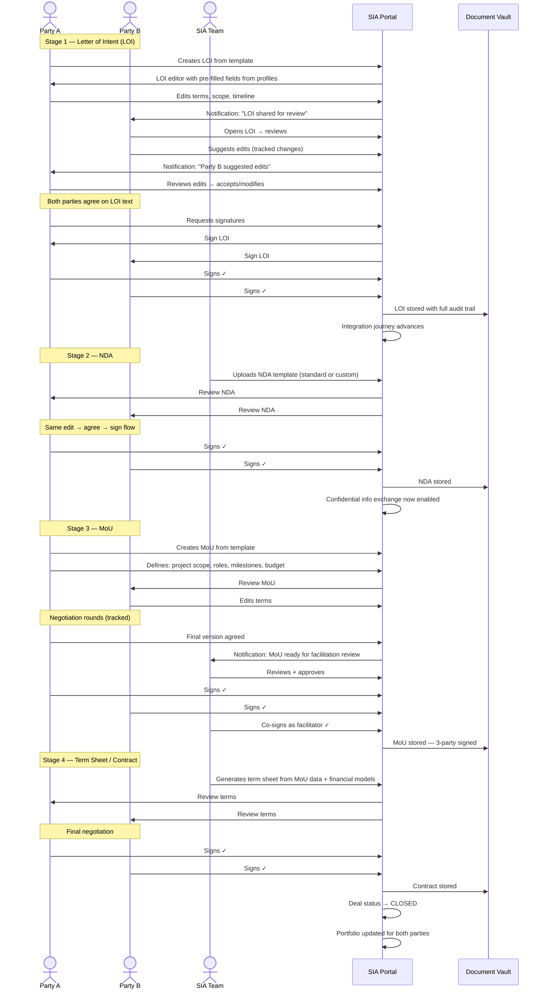

### Document Editor Capabilities

```mermaid
flowchart TD
    subgraph DOC_EDITOR [Collaborative Document Editor]
        T1[Start from template library\nLOI / NDA / MoU / Term Sheet / Custom]
        T1 --> T2[Auto-fill from partner profiles\nCompany names, registration, addresses, sectors]
        T2 --> T3[Edit terms and conditions\nRich text editor with structured sections]
        T3 --> T4[Track changes\nEvery edit logged: who changed what, when]
        T4 --> T5[Comment threads\nInline comments on specific clauses]
        T5 --> T6[Version history\nRoll back to any previous version]
        T6 --> T7[Lock for signing\nNo more edits once signing is requested]
        T7 --> T8[Multi-party signature\nEach signer signs independently]
        T8 --> T9[Finalize + store\nAudit trail: hash, timestamps, IPs, identities]
    end
```

---

## Secure Deal Room

When a deal reaches a certain complexity (multiple stakeholders, authorities, documents), a **deal room** is created — a secure collaboration space.

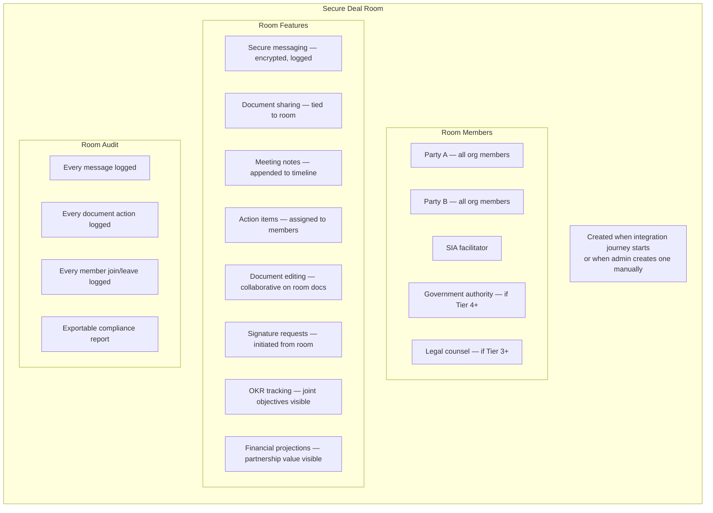

### Deal Room Activity

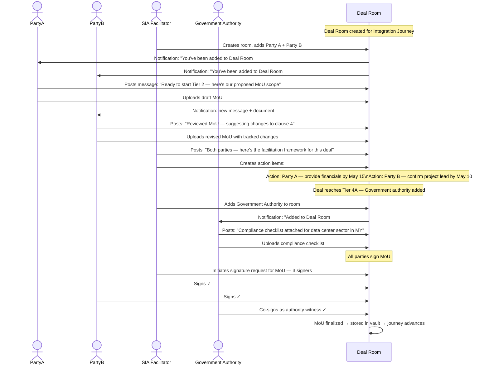

---

## Portfolio Aggregation — The Arsenal View

The platform can aggregate portfolios across partnered organizations to present a unified "arsenal" to investors and governments.

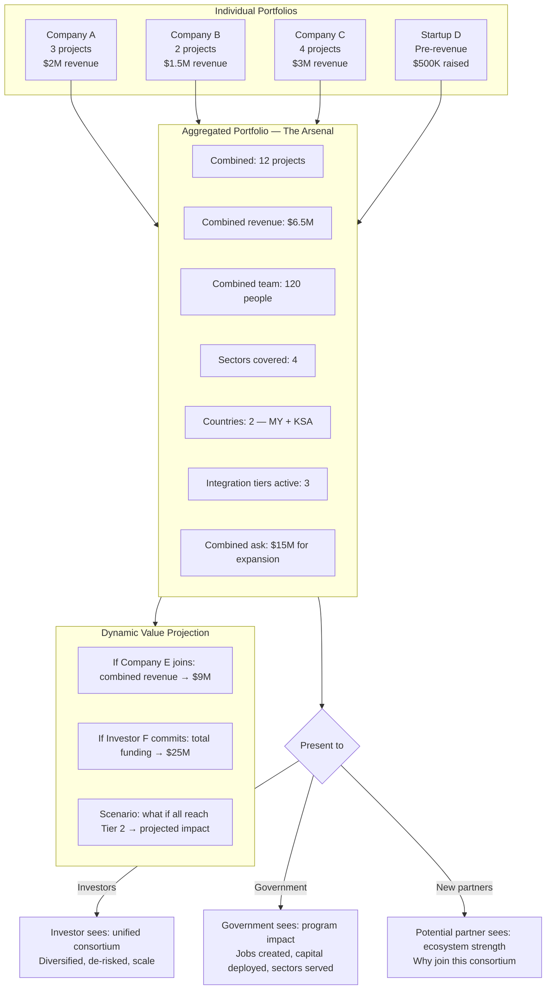

---

## How Everything Connects

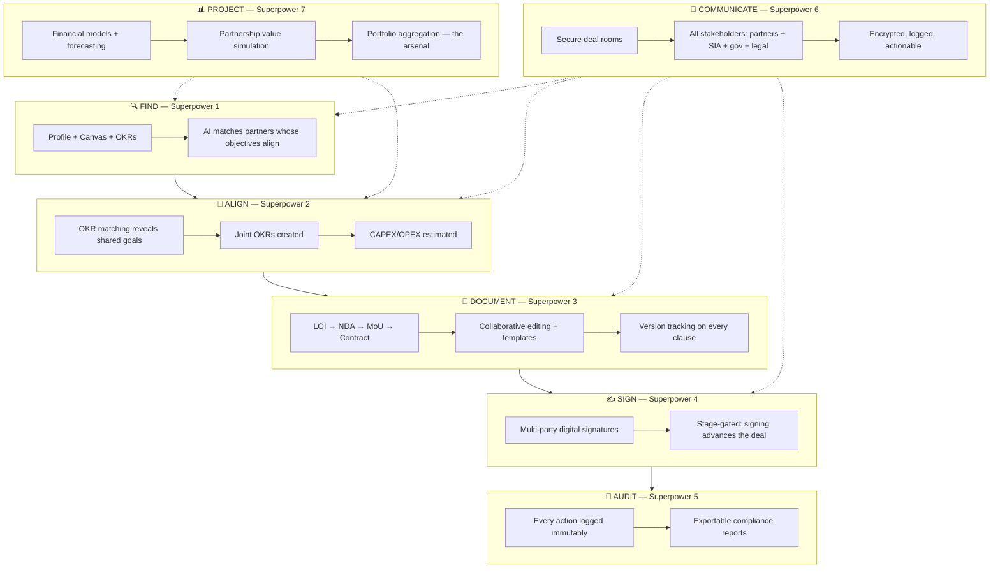
